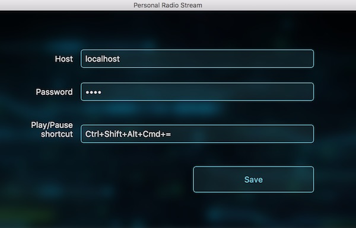

Radio Stream
============

About
-----
**Radio Stream** is your personal music service that streams music automatically based on your listening habits.

* **Your music** - Use your own music files without restrictions.
* **Automatic DJ** - Enjoy music immediately without choosing a specific song or album. The music is selected based on when you last heard it, its rating and more. Read more [below](#automatic-dj).
* **Dynamic playlists** - Want to hear only some of your music? Create a music playlist, e.g, only with genre Heavy Metal, and have the automatic DJ stream the music from that station.
* **Desktop and Mobile clients** - Listen to your music when you're on another computer or on your mobile phone.
* **Last.FM support** - Scrobble your music to Last.FM
* **Powered by beets** - Use the super-powerful [beets](https://github.com/beetbox/beets) and all its plugins to organize your music. 
* **Open source** - Modify the applications for any missing features. 

  

Automatic DJ
------------
Each time you start listening to your music **Radio Stream** makes a list of songs with the following consideration:

* **Rating** - Higher rated songs will appear more.
* **Play date** - Songs that were played least recently will appear more.
* **Play count** - Songs that were played less (e.g. new songs), will appear more.
* **Unrated songs** - Unrated songs are considered new and are played more often.
* **Limit artist repitions** - Prevent a single artist to repeat too many time.

Each of these rules contribute to a "score" of a song which decides which song will be streamed next.

How to use
==========

Prerequirements
---------------
You need [docker](https://www.docker.com/products/overview) to run the server. So far I've ran it successfully on **Mac** and **Linux**. 
You might be able to run it on **Windows 10** too, if you use **bash for Windows** (for example like the one that comes with git for Windows).

The clients are available for Mac and Android.

Getting started
---------------

**Important:** All the following commands should be executed in your terminal relative to the root folder. So if you unzipped the application to: `~/radio-stream-cli` then you should open the terminal and run `cd ~/radio-stream-cli`.

* Clone this git repositry or [download](TODO) the zip
* Open the terminal in the downloaded directory
* Run: `bin/server/start`

If all goes well, docker will download the Radio Stream and connect to it. You should see:

    *******************
        RadioStream
    *******************
    User: radio
    Password: radio

    Available scripts:

    beet
    bls
    pending_delete
    recently-added
    recently-played
    unrated
    youtube

At this point your server is running and listening on port **80**.

**NOTE:** To allow incoming connection in your firewall or router to allow external connections.

**NOTE:** In the future, it is suggested to run the `start` with a `-p PASSWORD` flag instead of the default password.

The `bin/server/start` command has flags for additional configuration:

* Password: Use the `-p` flag to change the password, e.g: `bin/server/start -p PASWORD` flag, e.g: `bin/server/start -p 1234`
* Music folder: Use the `-m` flag to set the folder where the imported music resides. By default it is in `library/music` folder

Connect with a client application
---------------------------------

Before you proceed, let's verify that the server is online and working. 

Download one of the client applications:

* [Mac](TODO) 
* [Android](TODO)

Launch the application and enter the IP address of the server and the default password: `radio`

 

If everything works as expected, you should see this screen:

 

If it doesn't connect, please see [troubleshooting](#troubleshooting) below.

At this point we have no music so let's add some.

Managing music
==============

Adding existing music library
------------------------------
Copy your music files to the folder `library/new-music`. Then run: `bin/app/import`. Once the import is complete your music will be moved to `library/music`.

Import process is described in more detail in beet's documentation [here](http://beets.readthedocs.io/en/v1.4.2/reference/cli.html#import)

Adding music from YouTube
-------------------------

You can easily add music from YouTube by running: `bin/app/youtube YOUTUBE_VIDEO_URL`. 

This would download the audio and add it to your library.

Listing your music
------------------
To list the music you added you can run `bin/app/beet ls` or for a nicely formatted table `bin/app/bls`. 

This command is using beet's list command and its (query syntax)[http://beets.readthedocs.io/en/v1.4.2/reference/query.html)]. So for example to list only your beatles songs you could run: `bin/app/bls the beatles`

I've created several scripts for commonly used queries:

* `bin/app/recently_added` - Lists recently added songs, ordered by add date
* `bin/app/recently_played` - Lists recently played songs, ordered by play date
* `bin/app/unrated` - Lists unrated songs
* `bin/app/pending_delete` - Shows songs with 1 star sorted by add date (new songs first)

You can create new ones for your needs by copying one of them and changing the query.

Config file
===========

Make user config file
---------------------

The config file is located at: `config/config_source.yaml` in YAML format.

To modify its settings, copy it first:

`cp config/config_source.yaml config/config_user.yaml`

In the following sections modify the copied **config_user.yaml** file.

Playlists
---------

By default a single playlist is included, "All music":

    playlists:
        - name: All music
          query: ""

To add a new playlist, simply copy these lines, give it a new name and define a query in beet's [query langauge](http://beets.readthedocs.io/en/v1.4.2/reference/query.html). For example, if we wanted to create a new playlist for Rock, this config part would look like so:

    playlists:
        - name: All music
          query: ""
        - name: All music
          query: genre:Rock

Once you finish, run the `bin/server/start` to restart the service and reload the new configuration.

Last.FM
-------

To enable scrobbling your plays to Last.FM change the following part in the configuration:

    last-fm:
        username:
        password:

Once you finish, run the `bin/server/start` to reload the new configuration.

Adding an alias to common scripts
----------------------
echo alias beet=$(pwd)/bin/app/beet
echo alias bls=$(pwd)/bin/app/bls

Save it in your .bashrc file

Upgrading
=========

Download the latest version, as described [before](#getting-started). If you've cloned the repositry via git, simply run `git pull`.

Next upgrade the container `bin/server/upgrade` and then start it again with the `/bin/server/start` command.

Troubleshooting
===============

In this order:

* Run: `bin/app/status`. You should be getting the username and the password.
    * If you don't get these, the container isn't running, run: `bin/server/logs` to see what went wrong and open an issue.
* On the computer running the server, run: `curl -u radio:MY_PASSWORD http://localhost/radio-stream/api/playlists`
    * You should be getting the current available playlists. If you get error 401 your password is wrong.
* Get the ip address of the server and from another computer (e.g where you're trying to listen to music) try running: `curl -u radio:MY_PASSWORD http://MY_IP_ADDRESS/radio-stream/api/playlists`
    * If that doesn't work make sure port 80 is open in server's firewall/router.

Command reference
=================

* `bin/server/beet radio-preview` - Shows the songs and their calculated rankings
    * `-p PLAYLIST` - Only show songs that belong to the given playlist
    * `-c COUNT` - Limit the number of results
    * `-h` - List all the flags
* `bin/server/start` starts the server. It has the following flags:
    * `-p` - Set the password of the server - Avoid using default
    * `-m` - Set the folder where the imported music resides. By default it is in `library/music` folder
    * `-h` - List all the allowed flags
* `bin/server/stop` - Stops the server
* `bin/server/upgrade` - Upgrade the server to latest version
* `bin/server/connect` - Connect to a running docker container instance bash instance

Why I made Radio Stream
=======================

I have a relatively large music library which is too large to store on a device. Initially I've relied on various partial syncing solutions for the iPhone, but my solutions were flawed, especially so once I've started using an Android phone. I wanted to have easy access to my library from any device I use.

Additionally, I don't like all my music library the same, so playing it on shuffle was a disappointing experience - I want to listen more to songs I like more. And I definitely don't want to listen to a song I just listened a day ago because it got shuffled again. I wanted a more intelligent way to choose the music for me.

I've looked into several online service, but they were other limited in some way or lacked the features I wanted. Eventually I decided I will just do it myself.
